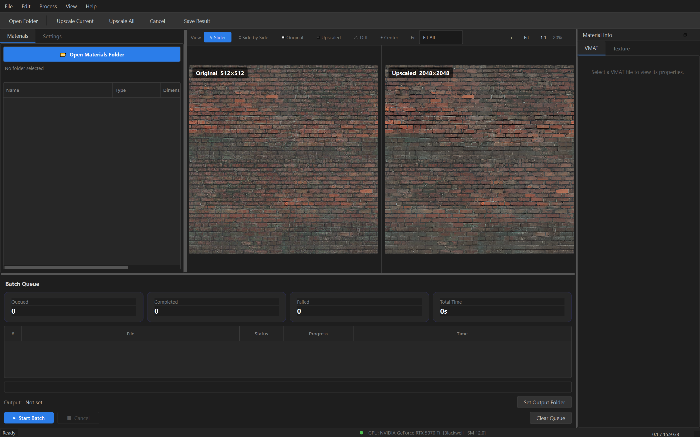
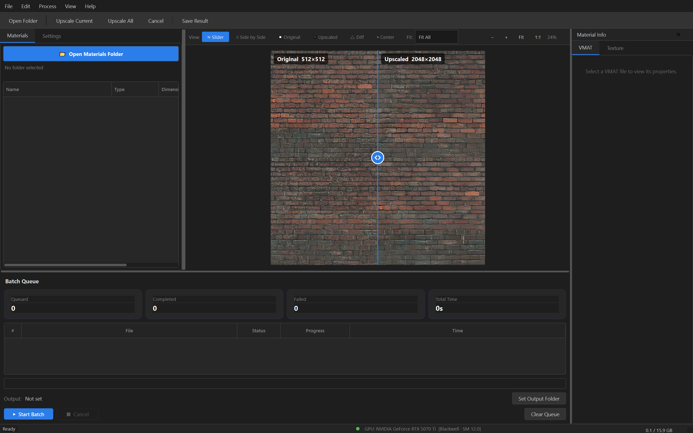
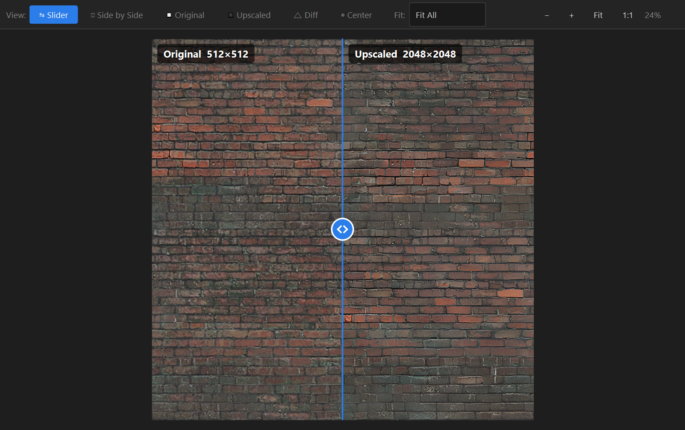

# CS2 Neural VMAT Upscaler

AI-powered texture upscaler purpose-built for Counter-Strike 2 materials. Upscale entire material folders — diffuse, normal, roughness, metallic — with full VMAT awareness, material-specific enhancement, and PBR map generation.


---

## Screenshots

### Slider Comparison — 512×512 → 2048×2048 Brick Texture


### Full Application Window


### Preview Close-up


---

## Features

### VMAT-Aware Pipeline
- **Parses Source 2 `.vmat` files** — reads shader type, texture roles, feature flags, and surface properties
- **25+ CS2 shaders recognized** — `csgo_complex.vfx`, `csgo_weapon.vfx`, `csgo_character.vfx`, `csgo_glass.vfx`, `csgo_foliage.vfx`, and more
- **26 texture roles** — Color, Normal, Roughness, Metalness, AO, Self-Illum, Emissive, Detail, Tint Mask, Height, Blend Mask, and more
- **Surface property → material type mapping** — automatically applies correct enhancement profile based on VMAT metadata
- **VMAT update** — optionally writes PBR paths and material values back into the VMAT file

### AI Upscaling Engine
- **4 Real-ESRGAN models** — x4+, x2+, Anime 6B, and ESRNet for different texture types
- **2×, 4×, 8× scale factors** — from subtle enhancement to massive resolution boosts
- **Automatic tile sizing** — adapts to available VRAM for maximum GPU utilization
- **FP16 half-precision** — faster inference with lower VRAM usage
- **CUDA accelerated** — full GPU support with automatic CPU fallback
- **torch.compile** — optional Triton acceleration on supported hardware

### Material-Aware Enhancement (30 Material Types)
Each texture is classified and enhanced with a tuned profile:

| Category | Types |
|----------|-------|
| **Metals** | Bare, Painted, Rusted, Brushed |
| **Stone** | Rough Stone, Polished Stone, Concrete, Brick, Ceramic Tile |
| **Wood** | Raw, Finished, Weathered |
| **Fabric** | Woven, Leather, Carpet |
| **Organic** | Foliage, Bark, Skin |
| **Synthetic** | Plastic, Rubber, Glass |
| **Environment** | Dirt, Sand, Gravel, Asphalt, Plaster, Wallpaper |
| **Special** | Decal/Text, Emissive/Screen, Generic |

Enhancement pipeline per material: CLAHE contrast → frequency-split detail → wavelet sharpening → structure enhancement → color correction.

### PBR Map Generation
- **Roughness maps** from multi-scale detail analysis
- **Metalness maps** from saturation/hue classification
- **Normal maps** from height estimation
- **24 material-specific PBR profiles** with CS2-tuned values for roughness, metalness, normal strength, and specular response

### Texture Processing
- **Normal map renormalization** — unit-length normals after upscaling (no shading artifacts)
- **Seamless tiling** — wrap-padded borders for perfect texture tiling
- **Alpha channel preservation** — separated alpha with Lanczos upscaling
- **Color stats matching** — per-channel mean/std correction locks output colors to original
- **Flat region protection** — variance-masked blending suppresses AI artifacts on solid colors
- **Mipmap generation** — full mipmap chain for engine import

### Format Support

| Format | Load | Save | Notes |
|--------|------|------|-------|
| PNG | ✓ | ✓ | Lossless, adjustable compression |
| TGA | ✓ | ✓ | RLE compression — CS2 native format |
| JPEG | ✓ | ✓ | 4:4:4 subsampling |
| BMP | ✓ | ✓ | Uncompressed |
| TIFF | ✓ | ✓ | Multi-page support |
| WebP | ✓ | ✓ | Lossless + lossy |
| DDS | ✓ | — | Read via imageio |
| EXR | ✓ | ✓ | HDR with tone mapping |

### Professional UI
- **Dark theme** — game-tool-inspired interface
- **Before/after slider** — interactive comparison with center button
- **Side-by-side, difference, original-only, upscaled-only** view modes
- **Batch processing** — queue hundreds of textures with progress tracking
- **Materials browser** — tree view of VMAT materials with texture roles
- **GPU monitor** — real-time VRAM usage in the status bar
- **Drag & drop** — drop files or folders directly onto the window
- **Zoom & pan** — mouse wheel zoom, middle-click pan, 1:1 pixel view

---

## Getting Started

### Requirements
- **Python 3.10+**
- **NVIDIA GPU** with CUDA support (recommended, 4GB+ VRAM)
  - CPU mode available but significantly slower

### Installation

```bash
# Clone the repository
git clone https://github.com/vindict6/CS2-Neural-VMAT-Upscaler.git
cd CS2-Neural-VMAT-Upscaler

# Create a virtual environment (recommended)
python -m venv venv
venv\Scripts\activate

# Option A: Use the automated installer (Windows)
install.bat

# Option B: Manual install
# Install PyTorch with CUDA (visit https://pytorch.org for your CUDA version)
pip install torch torchvision --index-url https://download.pytorch.org/whl/cu121

# Install remaining dependencies
pip install -r requirements.txt
```

### Download Models

Download the Real-ESRGAN model weights and place them in the `models/` directory:

| Model | Size | Use Case |
|-------|------|----------|
| [RealESRGAN_x4plus.pth](https://github.com/xinntao/Real-ESRGAN/releases/download/v0.1.0/RealESRGAN_x4plus.pth) | 63 MB | General-purpose 4× upscale |
| [RealESRGAN_x2plus.pth](https://github.com/xinntao/Real-ESRGAN/releases/download/v0.2.1/RealESRGAN_x2plus.pth) | 63 MB | Conservative 2× upscale |
| [RealESRGAN_x4plus_anime_6B.pth](https://github.com/xinntao/Real-ESRGAN/releases/download/v0.2.2.4/RealESRGAN_x4plus_anime_6B.pth) | 17 MB | Stylized / hand-painted textures |
| [RealESRNet_x4plus.pth](https://github.com/xinntao/Real-ESRGAN/releases/download/v0.1.1/RealESRNet_x4plus.pth) | 63 MB | PSNR-oriented (normals, roughness) |

### Launch

```bash
python main.py
```

---

## Usage

### Quick Start
1. **Launch** the application
2. **Open a materials folder** — point it at your CS2 `materials/` directory
3. Browse the **Materials tree** to see parsed VMAT files and texture roles
4. Click **Upscale Current** or **Upscale All** (Ctrl+U / Ctrl+B)
5. **Compare** using the before/after slider
6. **Save** with Ctrl+S

### Batch Processing
1. Open a **materials folder** (File → Open Folder)
2. Set the **output directory** in the batch panel
3. Click **▶ Start Batch**
4. Monitor progress in the queue table — each texture shows status, progress bar, and processing time
5. Cancel anytime — **Clear Queue** resets everything for a fresh start

### Optimal Model Selection

| Texture Type | Recommended Model | Notes |
|---|---|---|
| Diffuse / Albedo | Real-ESRGAN x4+ | Best perceptual quality |
| Normal Map | Real-ESRNet x4+ | PSNR-oriented, auto-renormalizes |
| Roughness / Metallic | Real-ESRNet x4+ | Preserves data accuracy |
| Stylized / Hand-painted | Anime 6B | Cleaner edges, less noise |
| Height Map | Real-ESRNet x4+ | Data-accurate |
| Emissive | Real-ESRGAN x4+ | Perceptual quality |

### VRAM Guide

| VRAM | Recommended Tile Size |
|------|----------------------|
| 4 GB | 256 |
| 6–8 GB | 512 |
| 10+ GB | Set to 0 (auto) |

The default tile size is **0** (automatic), which selects the largest tile that fits in VRAM.

---

## Keyboard Shortcuts

| Shortcut | Action |
|----------|--------|
| `Ctrl+O` | Open texture(s) |
| `Ctrl+Shift+O` | Open folder |
| `Ctrl+S` | Save result |
| `Ctrl+U` | Upscale current texture |
| `Ctrl+B` | Start batch processing |
| `Escape` | Cancel processing |
| `Ctrl+0` | Fit to window |
| `Ctrl+1` | Zoom to 100% |
| `Mouse wheel` | Zoom in/out |
| `Middle-click drag` | Pan |
| `Left-click drag` | Move comparison slider |
| `Ctrl+Q` | Exit |

---

## Project Structure

```
CS2-Neural-VMAT-Upscaler/
├── main.py                    # Entry point
├── install.bat                # Automated Windows installer
├── requirements.txt           # Dependencies
├── config/
│   └── default.json           # Default configuration
├── models/                    # AI model weights (.pth)
├── docs/
│   └── screenshots/           # README screenshots
└── src/
    ├── app.py                 # Application bootstrap
    ├── core/
    │   ├── upscaler.py        # AI upscaling engine
    │   ├── material_enhancer.py # 30-type material enhancement
    │   ├── pbr_generator.py   # PBR map generation
    │   ├── vmat_parser.py     # Source 2 VMAT parser
    │   ├── texture_io.py      # Texture loading & saving
    │   ├── models.py          # Model management
    │   ├── pipeline.py        # Batch processing pipeline
    │   └── compat.py          # Python 3.13+ compatibility
    ├── ui/
    │   ├── main_window.py     # Main application window
    │   ├── preview_widget.py  # Before/after comparison canvas
    │   ├── batch_panel.py     # Batch queue & progress
    │   ├── settings_panel.py  # Settings controls
    │   ├── widgets.py         # Custom UI components
    │   └── theme.py           # Dark theme
    └── utils/
        ├── config.py          # Configuration management
        └── logger.py          # Logging setup
```

---

## License

MIT License — free for personal and commercial use.

---

## Acknowledgments

- [Real-ESRGAN](https://github.com/xinntao/Real-ESRGAN) by Xintao Wang et al.
- [BasicSR](https://github.com/XPixelGroup/BasicSR) for the training/inference framework
- Valve for Counter-Strike 2 and the Source 2 engine
